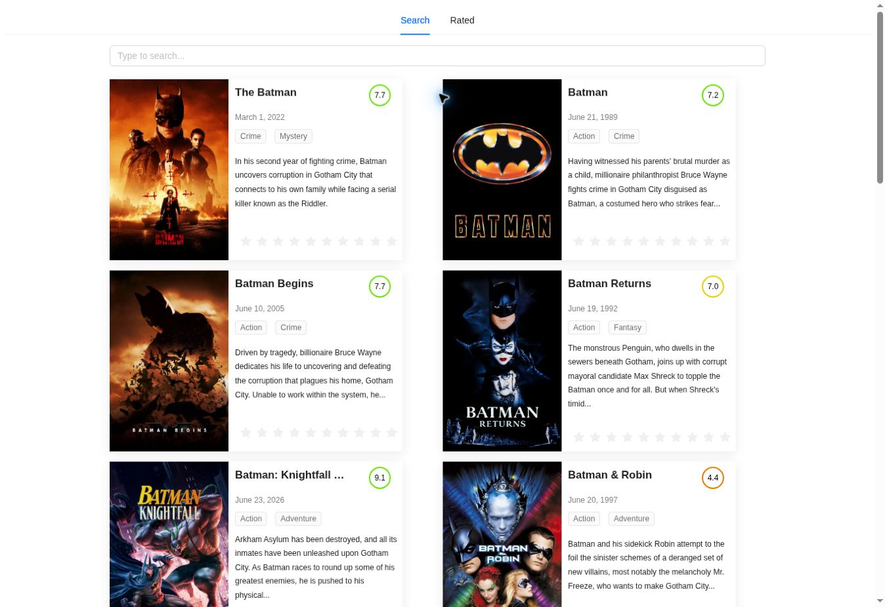

# Movie Search

React-приложение для поиска фильмов через TMDB с гостевыми оценками и отдельным списком оценённых фильмов.

[Демо](https://movieapp2-eosin.vercel.app/)



## Возможности

- Поиск фильмов и пагинация результатов.
- Карточки с постером, описанием, датой выхода, жанрами и рейтингом.
- Создание гостевой сессии TMDB.
- Отправка оценки и отдельная вкладка Rated.
- Состояния загрузки и сообщения об ошибках поиска.

## Стек

React, JavaScript, Ant Design, Context API, Fetch API / Axios, date-fns, Create React App.

## Технические решения

Запросы вынесены в `src/api`. Справочник жанров доступен через Context. Поиск, оценка и получение оценённых фильмов используют отдельные API-функции.

## Локальный запуск

```bash
npm ci
cp .env.example .env.local
# Укажите REACT_APP_TMDB_API_KEY в .env.local
npm run start
```

`npm run build` — сборка, `npm run lint` — проверка кода.


## Проверки и настройка API

`CI=true npm test -- --watchAll=false --runInBand` проверяет кодирование поискового запроса, ошибки оценки, совместное создание гостевой сессии и отсутствие конфигурации.

Для локального запуска и сборки на хостинге требуется `REACT_APP_TMDB_API_KEY`. Клиентская переменная окружения видна в сборке и не является секретным хранилищем. Ранее опубликованные учётные данные нужно отозвать в TMDB: удаление из текущих файлов не удаляет их из истории Git.

Интеграция с живым TMDB зависит от доступности API и действующего ключа. Публичное демо обновляется отдельно от этой ветки.
